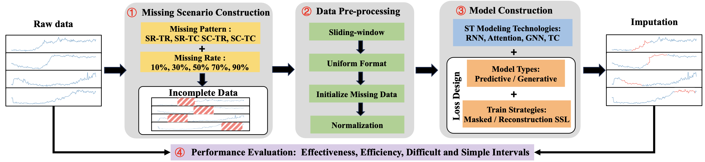
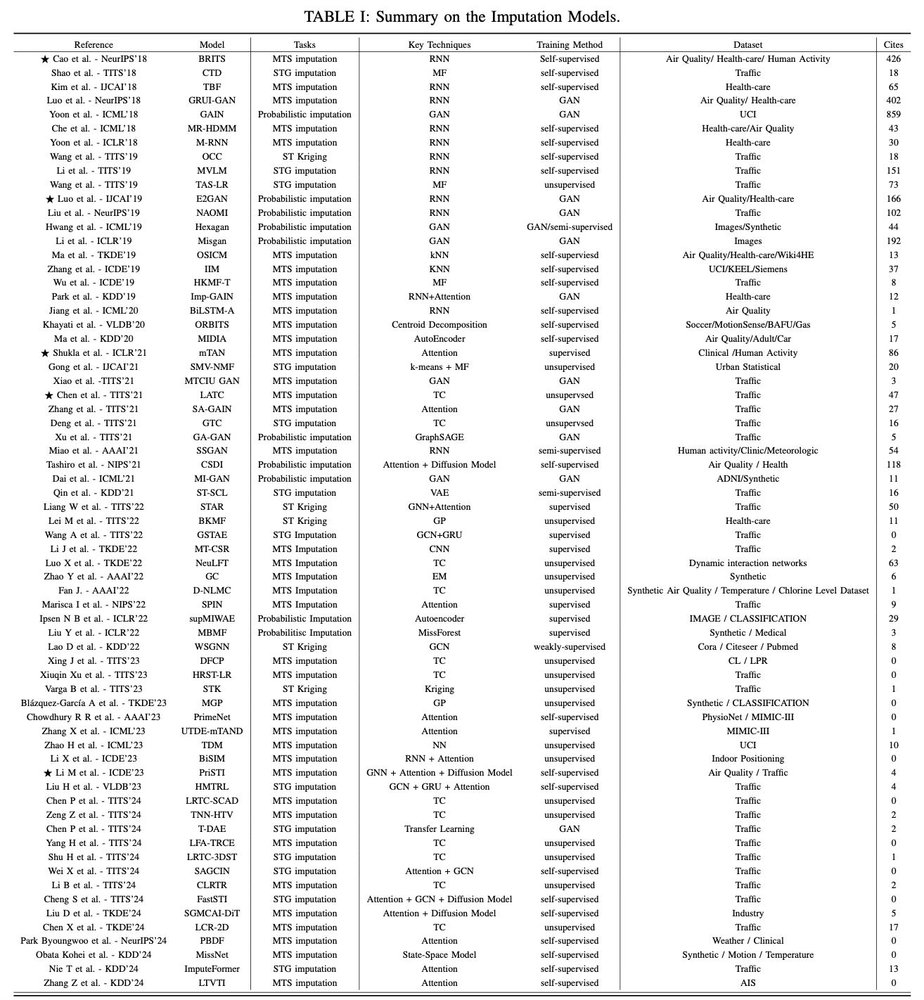

# imputation_benchmark

The official implementation of “An Experimental Evaluation of Imputation Models for Spatial-Temporal Traffic Data”



## Data and missing scenarios

We used **3** traffic datasets and **20** missing scenarios(**4** missing types and **5** missing rates) to evaluate each imputation model.

$$
\begin{array}
{cll}
\hline
	\text{Dataset} & \text{Time points} & \text{Nodes} & \text{Time Interval} & \text{Time range} \\
\hline
	\text{PEMS04} & 16692    & 307 & 5\text{mins} &2018.1.1-2018.2.28\\
	\text{PEMS08} & 17856    & 170 & 5\text{mins} &2016.7.1-2016.8.31\\
	\text{Seattle} & 8760    & 323 & 1\text{hour} &2015\\
\hline	
\end{array}
$$

$$
\begin{array}
{cll}
\hline
	\text{Missing pattern} & \text{Description}\\
\hline
	\text{SR-TR} & \text{Spatial random missing and Temporal random missing}\\
	\text{SR-TC} & \text{Spatial random missing and Temporal continuous missing}\\
	\text{SC-TR} & \text{Spatial continuous missing and Temporal random missing}\\
	\text{SC-TC} & \text{Spatial continuous missing and Temporal continuous missing}\\
\hline	
\end{array}
$$

Missing rates including **10%**, **30%**, **50%**, **70%**, **90%**

---

We have summaries of existing imputation models from 2018-2024.


## Constructing missing data for train and test (Optional)

Run the following command to construct the corresponding missing scenario from the raw data.

``` bash
cd GenerateData 
python generator.py --config xxx.conf --missrate 0.3 --misstype SR-TR
```

The **conf file** is configured with the save path, the raw data path, and a csv file containing the node adjacencies (distances).

Two files will be generated:

1. miss_data_{misstype}_{missrate}_v2.npz
2. true_data_{misstype}_{missrate}_v2.npz

**Usage**

``` python
#e.g. miss_datapath = miss_data_{SR-TR}_{0.9}_v2.npz
#e.g. true_datapath = true_data_{SR-TR}_{0.9}_v2.npz
miss = np.load(miss_datapath)
mask = miss['mask'] # mask matrix (T,N,F), 0 means missing
miss_data = miss['data'] # 0 means missing (T,N,F)

true_data = np.load(true_datapath)['data'] # ground-truth (T,N,F)

```

You can skip the data generation stage by wrapping the data in the above form.


## Train and Test imputation model

### AGCRN

``` bash
cd AGCRN/model
python Run.py --config ./configurations/PEMS04.conf
```

### BRITS

``` bash
cd BRITS
python input_process.py --config ./configurations/PEMS04_12_SR-TR_0.1_prepare.conf
python main.py --config ./configurations/PEMS04_12_SR-TR_0.1.conf --for_test 0
```

### E2GAN

``` bash
cd E2GAN
python train.py --config ./configurations/PEMS04_12_SR-TR_0.1.conf
```

### GCASTN

``` bash
cd GCASTN/GCASTN-main/code_data_paper_632/GCASTN
python train_GCASTN.py --config ./configurations/PEMS04.conf
```

### IGNNK

``` bash
cd IGNNK
python train.py --config ./configurations/PEMS04.conf
```

### LATC

``` bash
cd LATC
python train_LATC.py --config ./configurations/PEMS04_SR-TR_0.1.conf
```

### mTAN

``` bash
cd mTAN
python train.py --config ./configurations/PEMS04_SR-TR_0.5.conf
```

### PriSTI

``` bash
cd PriSTI/PriSTI-main
python exe_survey.py --config ./config/pems04.yaml
```

### ASTGNN

``` bash
cd ASTGNN
python train_ASTGNN.py.py --config ./configurations/PEMS04_SR-TC_70.conf
```

### ImputeFormer

``` bash
cd imputeformer
python main.py.py --config ./configurations/PEMS04.yaml --data_prefix ./miss_data --dataset PEMS04 --miss_type SR-TR --miss_rate 0.9
```
